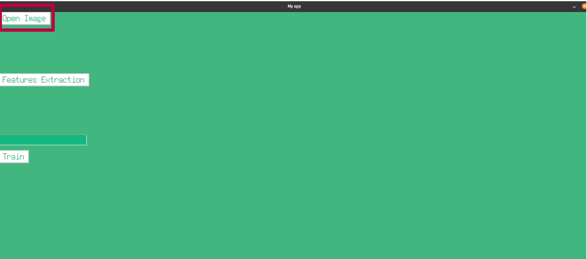
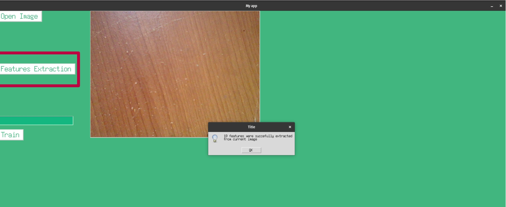
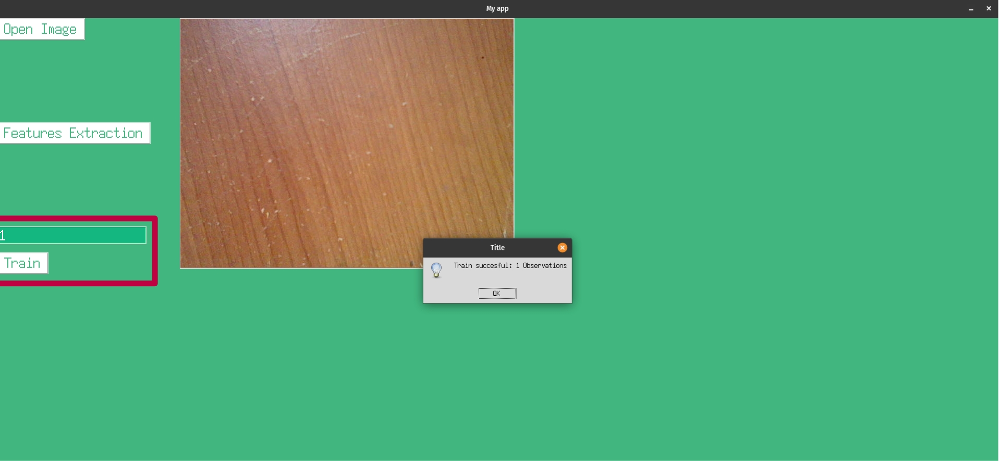
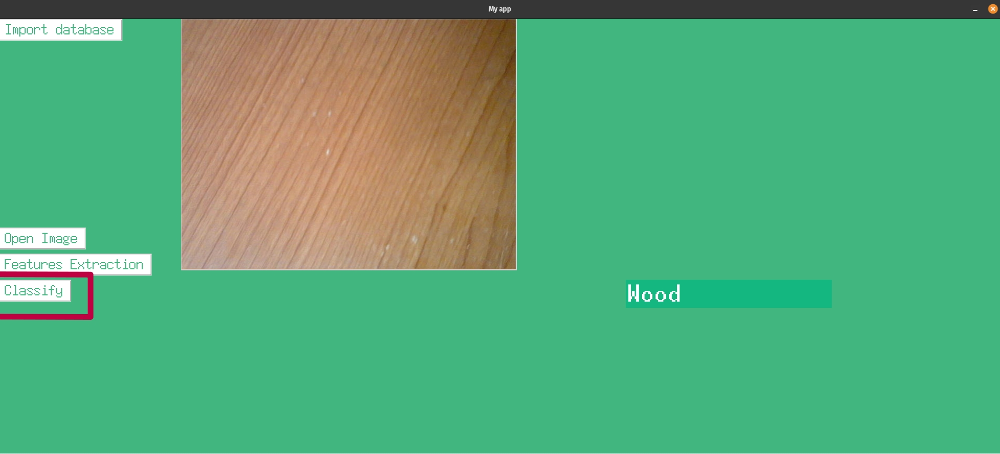

This project is an interactive interface that:
  1) Build a feature matrix and train a system
  2) Classify figures of 3 different materials: wood, cement, and fiber

Before launching the project, it is recommended to create a new environment:

```js
conda create --name materials python=3.7
conda activate materials
```

Requisites (Stable setup):
python 3.7 

```js
pip install Pillow numpy matplotlib opencv-python pandas openpyxl imutils scikit-learn

```

1. Training
   
Open the file "Training.py"
```js
python3 Training.py
```
The main window will be open. Select 'Open Image', and choose one image to start building your database.


Select "Features Extraction" to extract 19 features from the current image. A textbox confirms the correct extraction process "19 features were succesfully extracted from current image" 


Finally, add the label and press "Train" to add the extracted features to the Database. If it is the first time to use the app, a file "Db." will be created. We recommend to label materials as follows: 1: Wood;  2: Concrete;  3: Fiber. A textbox confirms the correct process "19 features were succesfully extracted from current image" 
  



2. Classify
   
You can directly classify materials by using the prebuilt Database named as "Db_60.xlsx", which has been built from the 60 figures in the folder "./Training". To do so, open the file "Classification.py"
```js
python3 Classification.py
```

Select "Import database" to import the prebuilt database "Db_60.xlsx". A legend will confirm the process "The Database Db_60 was successfully imported and used to train a Random Forest Classifier".


Open your image and extract features. You can use the test figures in the folter "./Test"
Select the option "Classify", and the name of the material will appear on the screen.


Repeat the process to classify other materials.

This is a simple demo where you can implement other classifiers. Modify the lines 183-188 to change the classifier, i.e. use a Support Vector Machine to compare results.
If you can implement your own database, you can modify the line 162 as "new_database = Db". This will change the database and will use "Db.xlsx" to train your classifier.


